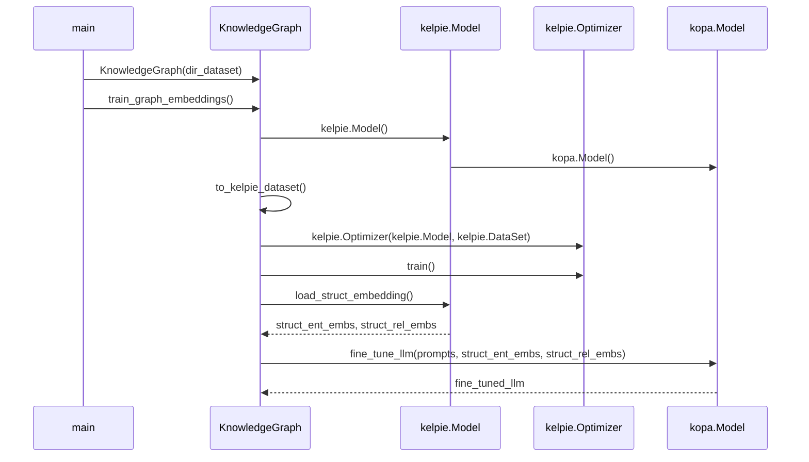
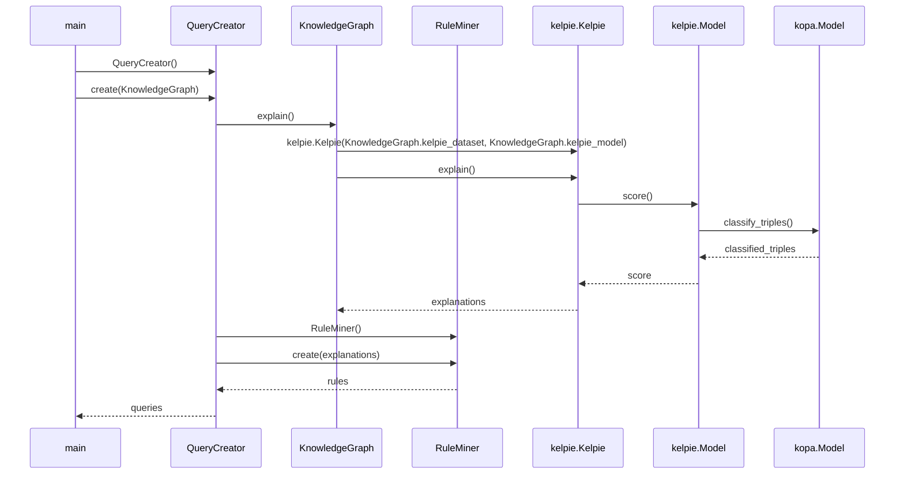

## Initialization

```mermaid
sequenceDiagram
    participant main
    participant KnowledgeGraph
    participant kelpie.Model
    participant kelpie.Optimizer
    participant kopa.Model

    main->>KnowledgeGraph:KnowledgeGraph(dir_dataset)
    main->>KnowledgeGraph:train_graph_embeddings()
    
    KnowledgeGraph->>kelpie.Model:kelpie.Model()
    kelpie.Model->>kopa.Model:kopa.Model()
    
    KnowledgeGraph->>KnowledgeGraph:to_kelpie_dataset()
    
    KnowledgeGraph->>kelpie.Optimizer:kelpie.Optimizer(kelpie.Model, kelpie.DataSet)
    KnowledgeGraph->>kelpie.Optimizer:train()
    
    KnowledgeGraph->>kelpie.Model:load_struct_embedding()
    kelpie.Model-->>KnowledgeGraph:struct_ent_embs, struct_rel_embs
    
    #KnowledgeGraph->>KnowledgeGraph:to_kopa_train_prompt()
    KnowledgeGraph->>kopa.Model:fine_tune_llm(prompts, struct_ent_embs, struct_rel_embs)
    kopa.Model-->>KnowledgeGraph:fine_tuned_llm
```

## Create Query

```mermaid
sequenceDiagram
    participant main
    participant QueryCreator
    participant KnowledgeGraph
    participant RuleMiner
    participant kelpie.Kelpie
    participant kelpie.Model
    participant kopa.Model
    
    main->>QueryCreator:QueryCreator()
    main->>QueryCreator:create(KnowledgeGraph)

    QueryCreator->>KnowledgeGraph:explain()
    KnowledgeGraph->>kelpie.Kelpie:kelpie.Kelpie(KnowledgeGraph.kelpie_dataset, KnowledgeGraph.kelpie_model)
    KnowledgeGraph->>kelpie.Kelpie:explain()
    kelpie.Kelpie->>kelpie.Model:score()
    kelpie.Model->>kopa.Model:classify_triples()
    kopa.Model-->>kelpie.Model:classified_triples
    kelpie.Model-->>kelpie.Kelpie:score
    kelpie.Kelpie-->>KnowledgeGraph:explanations

    QueryCreator->>RuleMiner:RuleMiner()
    QueryCreator->>RuleMiner:create(explanations)
    RuleMiner-->>QueryCreator:rules
    QueryCreator-->>main:queries
```
